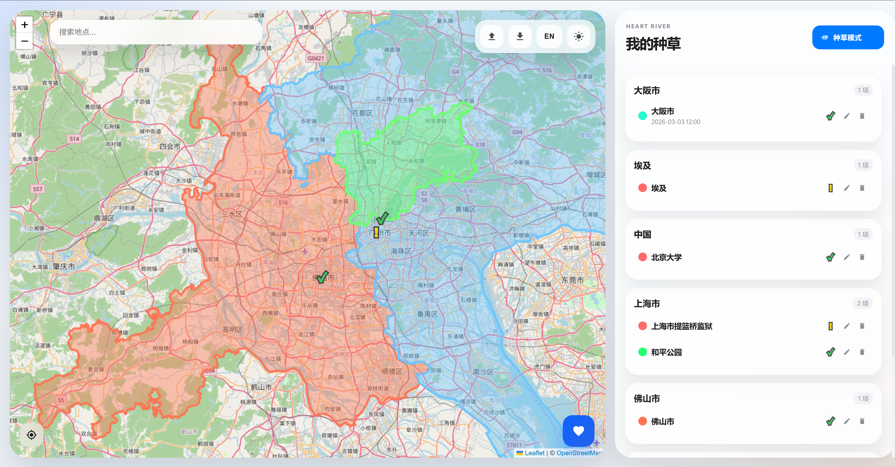

# Heart River

<table align="center" style="border: none; background: linear-gradient(135deg, #007AFF 0%, #5856D6 100%); border-radius: 20px; padding: 24px; width: 100%; max-width: 500px;">
  <tr style="border: none;">
    <td align="center" style="border: none; padding: 16px;">
      
    </td>
  </tr>
  <tr style="border: none;">
    <td align="center" style="border: none;">
      <h2 style="color: white; margin: 0; font-size: 28px;">Heart River</h2>
      <p style="color: rgba(255,255,255,0.9); margin: 8px 0 0; font-size: 16px;">旅行规划与种草管理工具</p>
    </td>
  </tr>
</table>

<p align="center">
  
  
  
</p>

---

## 应用简介

Heart River 是一款轻量级的旅行规划管理 Web 应用，让你在管理旅游时有一种在玩开放世界游戏做任务的快感！

**核心特点：双模式同屏管理**

- **规划模式**：创建旅行计划，添加景点节点，自动在地图上连线展示行程路线
- **种草模式**：收藏想去的地点，按城市分组管理，一键标记「已完成」

## 界面预览

### 种草模式



---

## 功能亮点

### 规划模式（待完成）
- 创建多个旅行规划，每个规划可设置名称、时间段、颜色和备注
- 在地图上添加节点（景点/餐厅/住宿等），自动记录经纬度
- 节点按添加顺序自动连线，清晰展示行程路线
- 支持按地名搜索定位，快速查找目的地

### 种草模式
- 在地图上标记想去的景点，自动获取城市信息
- 按城市分组展示，直观了解某地的种草清单
- 一键标记「已完成」，已完成的地点会显示绿色标记
- **后续会添加种草节点可以编辑插入图片、日志等功能，已完成的项目也可以当记录看**

### 通用功能
- **响应式设计**：桌面端并排显示地图和列表，移动端标签页切换
- **明暗主题**：支持亮色/暗色主题，记住你的偏好
- **双语支持**：中文/英文界面，随意切换
- **数据导入导出**：JSON 格式备份和恢复数据

---

## 使用指南

### 快速开始

1. 打开 `index.html` 即可使用（无需安装）
2. 点击右上角按钮切换「规划模式」/「种草模式」

### 添加规划

1. 在规划模式下，点击侧边栏的「新建规划」
2. 填写规划名称、开始/结束日期、选择颜色
3. 保存后，点击规划卡片选中它

### 添加节点

**方式一：搜索添加**
1. 在地图上方的搜索框输入地名
2. 点击搜索结果，地图会定位到该地点
3. 点击标记弹出按钮，选择「规划节点」或「种草」

**方式二：地图点击**
1. 在地图上点击任意位置
2. 如果已选中规划，会自动添加节点标记
3. 点击标记打开详情表单，填写地点名称等信息

### 添加种草

1. 切换到「种草模式」
2. 搜索或点击地图上的位置（点击位置还待优化）
3. 选择「种草」按钮
4. 填写名称（留空则自动使用城市名）

---

## 技术架构

本项目采用模块化结构，分为以下文件：

```
js/
├── i18n.js     ─ 国际化（中文/英文）
├── config.js   ─ 地图瓦片配置
├── data.js     ─ 数据持久化（localStorage）
├── map.js      ─ 地图核心功能（Leaflet）
├── ui.js       ─ UI 管理与渲染
└── app.js      ─ 应用入口与事件绑定
```

**模块依赖关系：**

```
┌─────────────────────────────────────────────┐
│                   index.html                │
└─────────────────┬───────────────────────────┘
                  │
      ┌───────────┼───────────┐
      │           │           │
      ▼           ▼           ▼
  i18n.js     config.js    data.js
   (翻译)      (地图配置)   (存储)
      │           │           │
      └───────────┼───────────┘
                  ▼
              map.js
         (地图操作与渲染)
                  │
                  ▼
               ui.js
        (界面组件与交互)
                  │
                  ▼
              app.js
          (主逻辑与事件绑定)
```

---

### 桌面端 vs 移动端

| 桌面端 | 移动端 |
|--------|--------|
| 左侧地图 70% + 右侧列表 30% | 底部标签栏切换 |

---

## 数据存储

所有数据保存在浏览器 `localStorage` 中：

- 规划数据：`heart_river_data`
- 语言偏好：`heart_river_lang`
- 主题偏好：`heart_river_theme`

**导出备份：** 点击右上角「导出」按钮下载 JSON 文件

**导入恢复：** 点击「导入」按钮，选择 JSON 文件或粘贴内容

---

## 开源技术

- **地图**：Leaflet + OpenStreetMap
- **日期选择**：flatpickr
- **存储**：浏览器 localStorage

---

## 浏览器兼容性

- Chrome / Edge / Firefox / Safari 最新版本
- 移动端浏览器（iOS Safari / Android Chrome）

---

## 图标

应用图标位于 `img/raw.png`（1024×1024 PNG），用于：
- 浏览器标签页图标（favicon）
- 移动端主屏幕图标（apple-touch-icon）

---

## 许可证

MIT License - 可自由使用和修改

---

*Made with ♥ for travelers*
